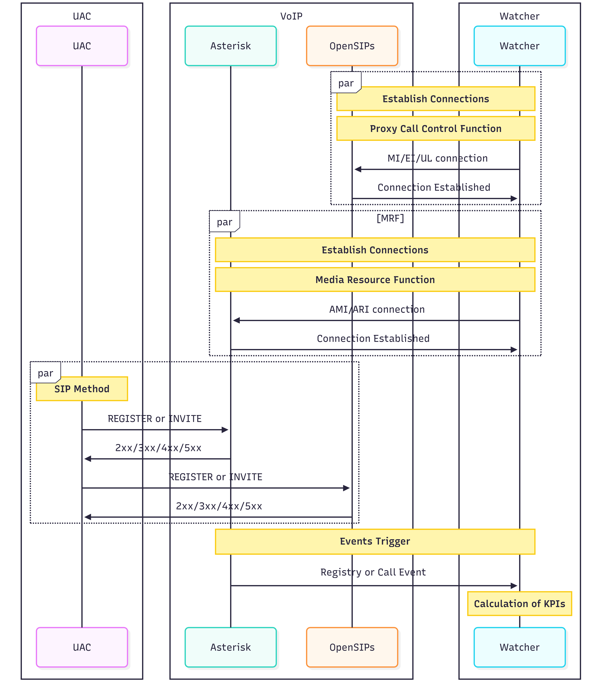
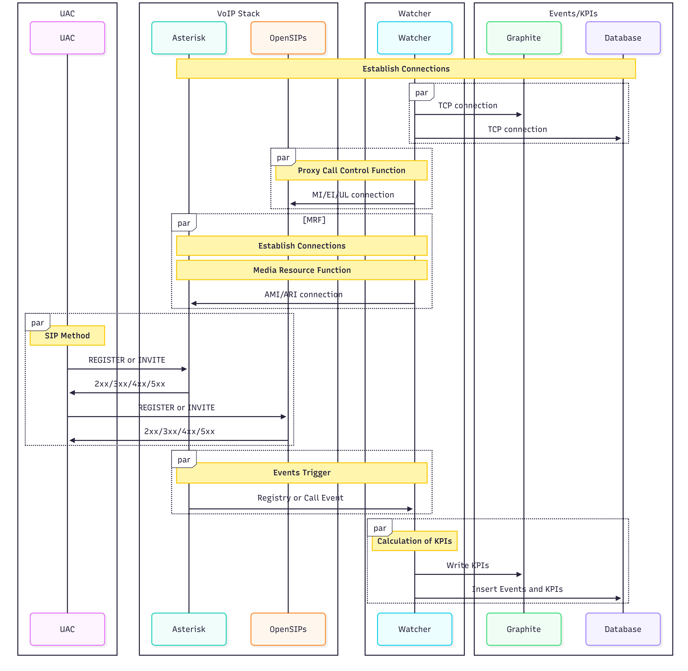

# Introduction

This page is dedicated to detailing the HLD of the project WATCHER.
The HLD is very specific about what the idea behind the WATCHER, the pros and cons of the technologies used to develop WATCHER as well as the usage of WATCHER in real life. 

# References

1. MRF:
    * Asterisk
        * AMI
            * [AMI](https://vicistack.com/blog/asterisk-manager-interface-guide/)
            * [AMI events](https://docs.asterisk.org/Latest_API/API_Documentation/AMI_Events/)
        * ARI
            * [ARI]()
            * [ARI events]()
    * Freeswitch
2. PCSCF
    * Opensips
        * Event Interface
            * [EI](https://www.opensips.org/Documentation/Tutorials-EventInterface-1-8)
        * Management Interface
            * [MI]()
    * Kamailo 
3. KPI
    * Graphite 
    * PostGresql
4. Messaging 
    * ActiveMQ

# Idea

The internet in full of greate tools created by greate builders, developpers and crators, but a general tool for VoIP KPIs is not really available out there, there are multiple tools that do very specific tasks but they are always limited.

Watcher supports all VoIP opensource tools on the Media Resource Function (MRF) level ad the Proxy Call Session Control Function (PCSCF) level such as Asteriks and OpenSIPs respectively.

These opensource tools are based on Events. Events are part of the call logic in these opensource tools, and are triggered whenever there is a new attempts of connection between the Client and the Server.

So, having a general tool that is able to collects these events and calculate KPIs in real time can be a huge advantage to VoIP operators and Service Providers (When opensouce is the backbone of their business model).

# Why it beats the obvious alternatives:

# Presentation

Watcher is a tool written in Ruby 3.0.2-p107 and based on Gems framework. Watcher is a tool designed for VoIP stacks based on opensource technologies. Watcher calculates Key Performance Indicators (KPIs) in real time and sends them to a specific monitoring system. KPIs help improve VoIP Quality of Service by tracking SIP Registry and SIP Call events respectively.

The KPIs supported by Watcher are numerous:
* Registry
    * Registration Success Rate (RSR) 
    * Registration Failure Rate (RFR)
    * Registration Active Count (RAC)
* Calls
    * Call Success Rate (CSR)
    * Call Failure Rate (CFR)
    * Call Active Count (CAC)

More KPI can be added on demand.

# How it works

Watcher work as a Linux/Debian daemon. Watcher is installed on a dedicated machine (physical or virtual) that is hosted by a linux system (requirements will be defined later), after the configuration of the configuration file in .yaml format where the path is in (/etc/watcher/wactcher.yaml).

As simple as that.

Watcher has the ability to connect to multiple APIs at once, listens to events, calculates KPIs and sends them to a monitoring system (they can also be read in the logs on INFO mode).

Supported APIs:
* Asterisk AMI over TCP
* Asterisk ARI over WebSocket
* OpenSIPS MI over UDP
* OpenSIPS EI over UDP
* Graphite over TCP
* Postresql over TCP

# Project Structure

1. bin/
    * In this directory, a RUBY script called watcher is the main script that starts and tops the watcher Daemon.
2. config/
    * In this difrectory, the user can find the watcher.yaml reference configuration file with default values.
    * The user can also find configuration examples of the supported opensource tools.
3. lib/
    * In this directory, the watcher logic is coded here, where :
        * watcher.rb: represents the main entry point of the Watcher threads logic. 
        * endpoints/: represents the directory where API logic is coded.
        * events/: represents the directory where events logic is coded.
        * dispatcher/: represents the directory where the metrics dispatcher is coded.
        * metrics/: tepresents the directory where the KPIs logic is coded.
4. spec/
    * In this directory, the unitary tests are coded. 

# Technologies

* Language: Ruby 3.0.2-p107
* Framework: Gems with rspec for unitary tests.
* TCPSockets, WebSockets and UDPSockets
* Threads and Mutes for thread safe access
* Queues
* YAML for configuration file
* Watcher runs as a debian service.
* Watcher is build into a debian package.

## Pros

## Cons

# Flows

## Events mecanism

The flow below shows how Watcher interacts with the VoIP stack and listen to events in order to calcullate KPIs.

## Events/KPIs

